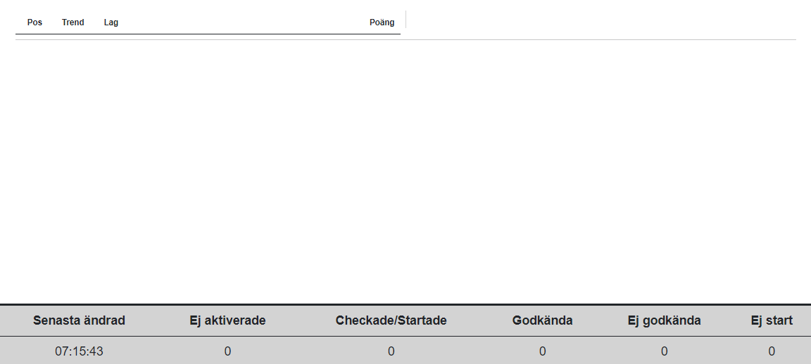
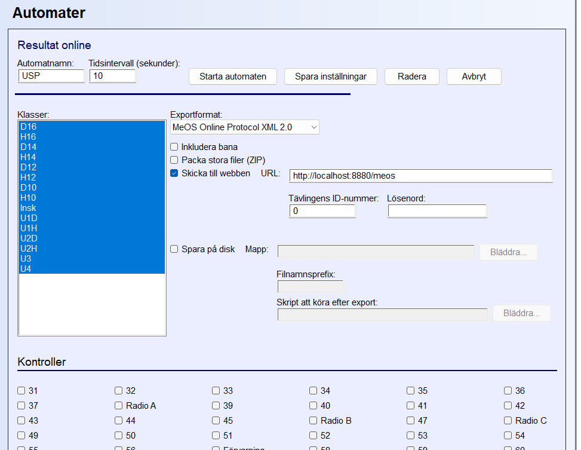
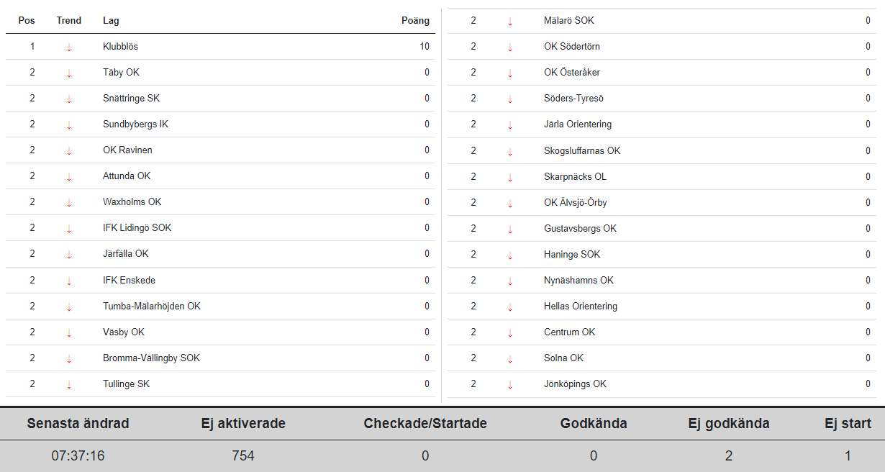

# Ungdomsseriepoäng

Ungdomsseriepoäng är en applikation som beräknar och presenterar klubbarnas poäng i Stockholms
orienteringsförbunds ungdomsserie. Applikationen hämtar data från det tävlingsadministrativa systemet, direkt eller inderekt, och presenterar aktuell ställning som en webbsida. Denna sida kan användas av speaker och även visas för publiken.

För närvarande stöds koppling till:


| <div style="width:100px">Datakälla</div> | Beskrivning                                                                                                                                                                                                                  |
| ----------------------------------------- | ---------------------------------------------------------------------------------------------------------------------------------------------------------------------------------------------------------------------------- |
| MeOS                                      | Automat i MeOS skickar data till denna applikation men HTTP-POST                                                                                                                                                             |
| OLA med MySQL                             | Data hämtas direkt från MySQL-databasen. Ännu inget stöd för den inbyggda databasen.                                                                                                                                    |
| Liveresultat                              | Data hämtas från http://liveresultat.orientering.se. Detta kräver att:<br/>- Resultat publiceras till Livresultat<br/>- Datorn där denna applikation körs måste ha tillgång till internet.                            |
| XML-resultat                              | IOF resultatfil i XML-format som sparas till katalog. Applikationen detekterar nya filer och läser in dessa. OLA och MeOS kan skapa dessa filer. Det är samma format som används för att publicera resultat till Eventor |

Poängen beräknas enligt instruktioner på:
[https://www.orientering.se/stockholm/utvecklingsmiljon/ungdom/ungdomsserien/arrangorsanvisningar-for-ungdomsserien/]()
Här beskrivs två metoder för poängberäkning: en för finalen och en för övriga deltävlingar. Applikationen stöder båda.

Applikationen startas och konfigureras från kommandoraden. T.ex.

```
usp --source Meos --pointscalc Normal
```

Presentationen sker via en webbserver i applikationen. Aktuell ställning visas på en eller flera webbläsare. Det finns ingen konfigurationssida utan inställningarna görs via URL-en. t.ex.
[http://localhost:8880/?columns=1&textsize=150]()
För publikskärm modifieras parametrarna tills det ser "snyggt" ut.

För speaker finns ett läge som ger mer information:
[http://localhost:8880/?verbose]()

## Installation

Ungdomsseriepoäng är byggd för att köras på Windows 64-bit. Borde även fungera på Linux om man bygger från källkoden, men det är inte testat.

### 1. Ladda ner och packa upp

Ladda ner `publish.zip` från senaste releasen
och packa upp den till en folder.

Applikationen körs från denna folder.

### 2.  Testa installation och konfigurera brandväggen.

Starta en kommandoprompt och sätt aktuell folder enligt ovan. Starta applikationen med

```
usp
```

För att stanna applikationen tryck `Ctrl-C`
Första gången man startar applikationen får man en fråga om att öppna i brandväggen. Om man vill komma åt webbsidan från andra datorer än denna måste man tillåta öppning av brandväggen. Det går också att senare gå in i Windows brandväggsinställningar och göra detta manuellt, men det är krångligare.

När applikationen startas utan parametrar startas automatiskt en simulering av en tävling där resultaten uppdateras. Denna kan ses på:
[http://localhost:8880/]()

## Inställningar

### Applikationen

När applikationen startas konfigureras den från kommandoraden. För att se de alternativ som finns kör:

```
usp --help
```

Det kan finnas fler än i detta dokument om jag slarvat med att uppdatera dokumentationen,

#### Generella alternativ


| <div style="width:150px">Alternativ</div> | Beskrivning                                                                                                                                                                                                                                                                                                 | Arg                        | Default   |
| ----------------------------------------- | ----------------------------------------------------------------------------------------------------------------------------------------------------------------------------------------------------------------------------------------------------------------------------------------------------------- | -------------------------- | --------- |
| `--source <arg>`                          | Väljer från vilken källa data ska tas. Simulatorn är inbyggd, men för övriga krävs ytterligare konfiguration.                                                                                                                                                                                        | Simulator<br/>Meos<br/>Ola | Simulator |
| `--listenerport <arg>`                    | Väljer vilken port webbservern ska lyssna på.                                                                                                                                                                                                                                                             | (Heltal)                   | 8880      |
| `--teams <arg>`                           | Sätter vilka klubbar som poäng ska presenteras för och, för finalen, vilka poäng klubbarna har från tidigare tävlingar. Om detta inte anges kommer alla klubbar som deltar få poäng och dessa räknas från noll.                                                                                  | Sökväg till CSV-fil      |           |
| `--pointscalc <arg>`                      | Väljer hur poängberäkningen ska ske. Det är olika regler för finalen och de övriga tävlingarna.                                                                                                                                                                                                      | Normal<br/>Final           | Final     |
| `--maxpatrolinterval <arg>`               | Patrull detekteras automatisk när flera löpare i en klass är från samma klubb och har samma starttid. Vid startsstämpling kan inte löparna få exakt samma starttid. Denna parameter anger hur många sekunder tiderna får skilja och ändå räknas som patrull                                     | (Heltal)                   | 10        |
| `--maxlatestart <arg>`                    | Om man har on-line check kopplat till TA-systemet kan man använda denna parameter för att räkna löpare som har status 'Ej aktiverade' som 'Ej start' om de inte har checkat angivet antal minuter efter sin lottade starttid. T.ex. 5 minuter. Detta gäller endast så länge status är ej aktiverad. | (Heltal)                   | 1000      |

Med `--teams <filnamn>` gör man 2 inställningar. Dels begränsas de klubbar som ska ingå i poängberäkningen och dels
anges de grund poäng som ska användas i finalen. Filen är en vanlig textfil. T.ex.:

```
OK Höjden,342
Sänkan OK,123
IFK Granen,92
Sankmarkens IF,0
```

Klubbarna måste vara stavade exakt som i TA-systemet.

#### Simulator-alternativ

Simulatorn startar automatiskt när applikationen startas. Följande inställningar finns för att modifiera simuleringen.


| <div style="width:150px">Alternativ</div> | Beskrivning                                             | Arg      | Default |
| ----------------------------------------- | ------------------------------------------------------- | -------- | ------- |
| `--speed <arg>`                           | Hastighet på simuleringen. Antal gånger snabbare.     | (Heltal) | 10      |
| `--numteams <arg>`                        | Antal klubbar som ska ingå i simuleringen. Max är 27. | (Heltal) | 27      |

#### MeOS-alternativ

För MeOS finns inga specifika alternativ, men `--listenerport <arg>` påverkar även till vilken port MeOS ska skicka resultaten.

Börja med att start applikationen. T.ex.;

```
usp --source meos
```

Surfa in på http://localhost:8880. En sida utan resultat visas.


Enklast är att köra MeOS på samma dator. Koppla upp MeOS mot databasen och öppna tävlingen. Under automater skapa en
"Resultat online" automat. URL ska vara http://localhost:8880/meos och `Packa stora filer (ZIP)` ska inte vara valt.

Kontroller behöver inte markeras.

Starta sedan automaten webbsidan kommer då att uppdateras


OBS! Om man stannar och sedan startar om applikationen, måste automaten i MeOS startas om.
MeOS skickar allt när den startar därefter endast förändringar.

#### OLA-alternativ

När man använder OLA som datakälla läser applikationen direkt från MySQL-database. Följande alternativ anger var databasen finns och inloggning till denna.


| <div style="width:150px">Alternativ</div> | Beskrivning                                                     | Arg                    | Default   |
| ----------------------------------------- | --------------------------------------------------------------- | ---------------------- | --------- |
| `--host <arg>`                            | IP-adress eller namn på servern som databasen finns på        | (IP-adress)<br/>(namn) | localhost |
| `--port <arg>`                            | Port som databasen lyssnar på. Default är MySQLs standardport | (Heltal)               | 3306      |
| `--database <arg>`                        | Namn på MySQL databas                                          | (Text)                 |           |
| `--user <arg>`                            | MySQL användarnamn                                             | (Text)                 |           |
| `--password <arg>`                        | MySQL lösenord                                                 | (Text)                 |           |

### Webbsidan

Efter det att applikationen startat (usp), surfar man in på:

```
http://localhost:8880
```

Detta gäller för samma dator som applikationen kör på. Om man kör från annan dator för man ange ip-adressen. TT.ex.:
Efter det att applikationen startat (usp), surfar man in på:

```
http://1.2.3.4:8880
```

Det finns inget gränssnitt för att styra utseendet utan det görs från URL-en. För att få större text och
3 kolumner använd:

```
http://localhost:8880?TextSize=120&Columns=3
```

Följande parametrar kan användas:


| <div style="width:150px">Alternativ</div> | Beskrivning                                                        | Arg                  | Default |
| ----------------------------------------- | ------------------------------------------------------------------ | -------------------- | ------- |
| `TextSize=nnn`                            | Ställer storleken på texten i resultatlistan                     | % av standardstorlek | 100     |
| `Columns=nn`                              | Antalet kolumner i resultattabellen                                | antal                | 2       |
| `Verbose=true`                            | Visar mer information i resultattabellen. Lämpligt för speakern. | true/false           | false   |

#### Aktuell ställning till fil

För att exportera aktuell ställning till CSV-fil, mata in nedanstående i webbläsaren och filen kommer att laddas ner till datorn.

Ladda ner poäng per klubb:

```
http://localhost:8880/teams
```

Ladda ner poäng per deltagare:

```
http://localhost:8880/participants
```
